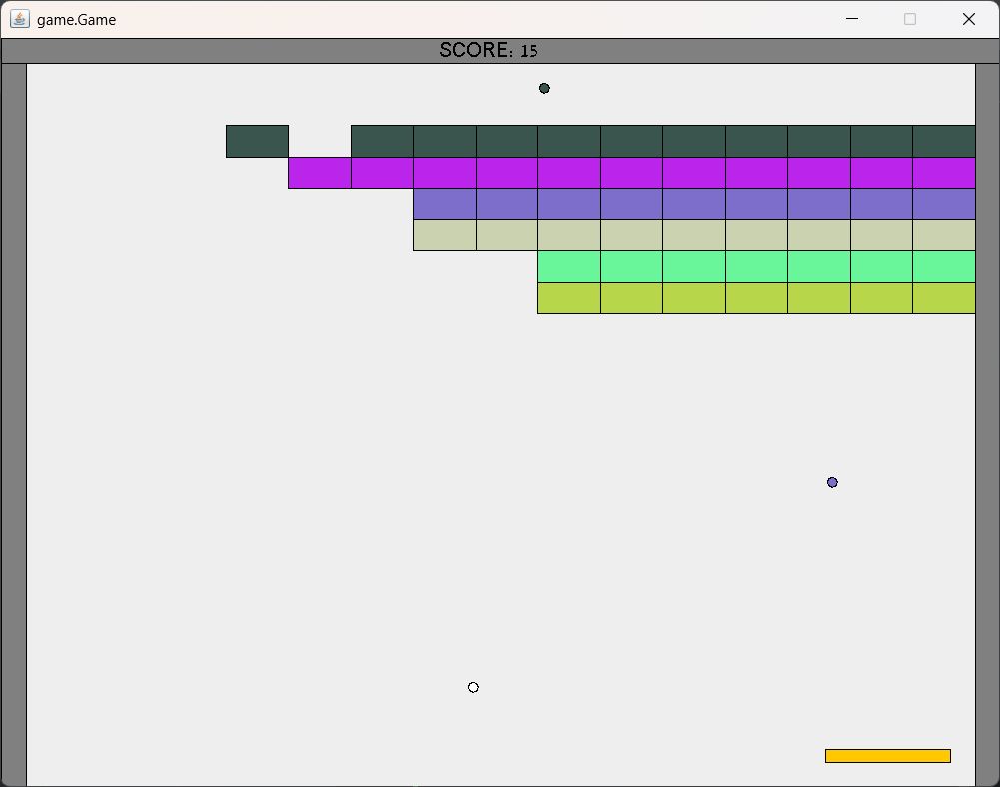

# Arkanoid 2D Game

A fully interactive 2D arcade game built from scratch in Java. This project implements real-time game logic, collision handling, and dynamic gameplay mechanics.

## Features
* **Custom Game Engine:** Architected using Object-Oriented Design principles for modularity and easy expansion of game features and levels.
* **Design Patterns:** Effectively utilizes **Observer**, **Factory**, and **Singleton** patterns to manage game events, object creation, and game state.
* **Real-time Mechanics:** Smooth collision detection and dynamic entity updating.

## Technologies
* **Language:** Java
* **Build Tool:** Apache Ant
* **Environment:** IntelliJ IDEA

## Prerequisites
To run this project locally, ensure you have the following installed:
* Java Development Kit (JDK) 8 or higher
* Apache Ant

## How to Build and Run

1. **Clone the repository:**
   ```bash
   git clone [https://github.com/YahavEfrati/Arkanoid.git](https://github.com/YahavEfrati/Arkanoid.git)
   cd Arkanoid

1. **Compile and Run the game::**
Since the project is configured with an Ant build script, you can easily run it using:
   ```bash
    ant run

